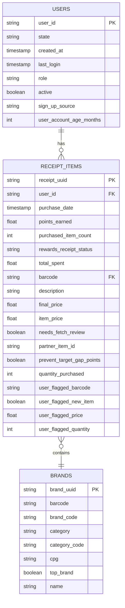

# scalable-data-modeling
This repository demonstrates an approach to structuring, modeling, and analyzing data. Using a modern data stack methodology, it features a scalable and efficient data model that transforms unstructured JSON data into a structured relational format, optimized for analytical queries.


# **dbt Analytics Project for  Rewards**
This repository contains dbt models, transformations, and tests for structuring and analyzing ** Rewards** data. The goal is to convert raw JSON data into structured tables optimized for analytics in **Snowflake**, leveraging **dbt** for transformation, validation, and documentation.

## **Project Overview**
This project extracts raw JSON files, normalizes them into **relational tables**, and transforms them into a structured data model using dbt. Key aspects of the project include:
- **Ingestion of JSON files** (users, receipts, brands) from `raw_json/`
- **Standardization of column names** to `snake_case`
- **Normalization of nested JSON fields** into structured tables
- **Data validation** through dbt tests (uniqueness, referential integrity, business rules)
- **Transformation of raw data** into a well-structured analytics schema in **Snowflake**
- **Automated dbt pipeline** to refresh transformed data

---

## **Data Processing Steps**
### **1. Raw Data Ingestion**
- The source data consists of **unstructured JSON files** located in `raw_json/`
- These JSON files are transformed into **CSV seeds** using a Python script
- The script performs the following:
  - Converts **nested JSON** into a tabular format
  - **Standardizes column names** to `snake_case`
  - **Truncates long fields** (> 131,072 characters) to avoid dbt errors
  - **Drops unnecessary columns** (`bonusPointsEarnedReason`)
  - **Stores cleaned CSV files** in `seeds/` for dbt ingestion

#### **Running the JSON Conversion Script**
To generate dbt seed files from raw JSON:
```bash
python scripts/json_to_csv.py
```
This script processes all files in `raw_json/` and outputs cleaned CSVs to `seeds/`.

---

### **2. Data Transformation Using dbt**
Once the CSV seeds are generated, dbt is used to **structure, clean, and validate the data**.

#### **dbt Models**
The project consists of **three key staging models**:
| Model | Description |
|-------|------------|
| `stg_seeds__users.sql` | Cleans and transforms raw user data |
| `stg_seeds__brands.sql` | Normalizes brand data |
| `stg_seeds__receipts.sql` | Processes receipts and flattens nested JSON fields |

#### **Executing dbt Transformations**
To run dbt transformations:
```bash
dbt run
```
To build models and ensure data integrity:
```bash
dbt build
```

---

### **3. Data Validation & Testing**
#### **Implemented dbt Tests**
| Test Type | Applied To | Purpose |
|-----------|-----------|---------|
| **Unique** | `user_id`, `brand_uuid`, `receipt_uuid` | Ensures no duplicate records exist |
| **Not Null** | Key fields (`state`, `purchase_date`, `total_spent`) | Ensures essential data is always present |
| **Relationships** | `user_id` in `stg_receipts` → `stg_users` | Ensures referential integrity |
| **Accepted Values** | `role` (should be `"CONSUMER"`) | Ensures `role` values are valid |
| **Expression Tests** | `total_spent >= 0`, `points_earned >= 0` | Ensures financial fields are never negative |

#### **Running dbt Tests**
To validate the data with dbt:
```bash
dbt test
```

---

### **4. dbt Sources & Schema Documentation**
#### **Source Configuration (`sources.yml`)**
Each raw table (`users`, `brands`, `receipts`) is defined as a **source** in dbt:
```yaml
version: 2

sources:
  - name: raw
    database: raw
    schema: raw
    tables:
      - name: users
      - name: brands
      - name: receipts
```
#### **Generating Documentation**
To generate **interactive dbt docs**:
```bash
dbt docs generate
dbt docs serve
```

---

## **Folder Structure**
```
fetch-dbt-project/
│── models/
│   ├── staging/
│   │   ├── stg_seeds__users.sql
│   │   ├── stg_seeds__brands.sql
│   │   ├── stg_seeds__receipts.sql
│   ├── schema.yml
│── seeds/
│   ├── users.csv
│   ├── brands.csv
│   ├── receipts.csv
│── scripts/
│   ├── json_to_csv.py
│── dbt_project.yml
│── README.md
```

---

## **How to Use This Project**
### **1️⃣ Set Up Your Environment**
Install dependencies:
```bash
pip install dbt-snowflake
```
Initialize dbt:
```bash
dbt init fetch-dbt-project
```

### **2️⃣ Process Raw JSON Data**
Run the Python script to convert JSON into dbt seed files:
```bash
python scripts/json_to_csv.py
```

### **3️⃣ Seed Data into Snowflake**
Load seed files into Snowflake:
```bash
dbt seed
```

### **4️⃣ Run dbt Models**
Execute transformations:
```bash
dbt run
```

### **5️⃣ Validate Data with dbt Tests**
```bash
dbt test
```

### **6️⃣ Generate Documentation**
```bash
dbt docs generate
dbt docs serve
```

---

## **Key Features**
✅ **Automated JSON Parsing** → Converts raw JSON into structured tables  
✅ **dbt Pipeline** → Automates transformations and data validation  
✅ **Robust Testing Suite** → Ensures data integrity and consistency  
✅ **Data Governance & Documentation** → Full schema documentation  

---


🔧 **Issues?**
If you encounter any issues, check the **error logs** in dbt or inspect the raw data in `seeds/`.

---
# **Entity-Relationship Diagrams (ERD)**



# **Analytics Queries for Rewards Data**

This document contains SQL queries to answer key business questions using the **Users**, **Receipt Items**, and **Brands** tables.

---

## **1️⃣ Top 5 Brands by Receipts Scanned for Most Recent Month**
### **Query**
```sql
with 

recent_month as (

    select 
        date_trunc('month', max(purchase_date)) as latest_month
        
    from fct_receipt_items r
    
    join dim_brands b 
        on r.barcode = b.barcode
    
)

select 
    b.name as brand_name,
    count(distinct r.receipt_uuid) as total_receipts
    
from fct_receipt_items r

join dim_brands b 
    on r.barcode = b.barcode

join recent_month rm 
    on date_trunc('month', r.purchase_date) = rm.latest_month

group by brand_name

order by total_receipts desc

limit 5;
```

### **Explanation**
- Retrieves the **most recent month** based on `purchase_date`.
- Counts the **number of receipts scanned per brand**.
- Returns **top 5 brands** based on receipt count.

### **Results Here**
```plaintext
BRAND_NAME	TOTAL_RECEIPTS
Cracker Barrel Cheese	10
Tostitos	10
Swanson	9
Prego	4
Diet Chris Cola	4
```

---

## **2️⃣ Month-over-Month Ranking of Top 5 Brands by Receipts Scanned**
### **Query**
```sql
with 

brand_rankings as (

    select 
        b.name as brand_name,
        date_trunc('month', r.purchase_date) as purchase_month,
        count(distinct r.receipt_uuid) as total_receipts,
        
        rank() over (
            partition by date_trunc('month', r.purchase_date) 
            order by count(distinct r.receipt_uuid) desc
        ) as brand_rank
        
    from fct_receipt_items r
    
    join dim_brands b 
        on r.barcode = b.barcode
    
    group by 1, 2
)

select * 

from brand_rankings

where brand_rank <= 5;
```

### **Explanation**
- Assigns **monthly rankings** for brands based on receipts scanned.
- Filters the results to include only **top 5 brands per month**.

### **Results Here**
```plaintext
BRAND_NAME	PURCHASE_MONTH	TOTAL_RECEIPTS	BRAND_RANK
Tostitos	2021-01-01 00:00:00.000	10	1
Cracker Barrel Cheese	2021-01-01 00:00:00.000	10	1
Swanson	2021-01-01 00:00:00.000	9	3
Diet Chris Cola	2021-01-01 00:00:00.000	4	4
Prego	2021-01-01 00:00:00.000	4	4
```

---

## **3️⃣ Average Spend on Accepted vs. Rejected Receipts**
### **Query**
```sql
select 
    rewards_receipt_status,
    round(avg(total_spent), 2) as avg_spend
    
from fct_receipt_items

where lower(rewards_receipt_status) in ('finished', 'rejected')

group by 1;
```

### **Explanation**
- Groups receipts by `rewards_receipt_status`.
- Computes **average spend** for `Accepted` vs. `Rejected` receipts. (`Accepted` doesn't exist in data so using `Finished`)

### **Paste Results Here**
```plaintext

```

---

## **4️⃣ Total Number of Items Purchased (Accepted vs. Rejected Receipts)**
### **Query**
```sql
select 
    rewards_receipt_status,
    round(avg(total_spent), 2) as avg_spend
    
from fct_receipt_items

where lower(rewards_receipt_status) in ('finished', 'rejected')

group by 1;
```

### **Explanation**
- Groups receipts by `rewards_receipt_status`.
- Computes **total number of items purchased** for `Accepted` vs. `Rejected` receipts.

### **Paste Results Here**
```plaintext
REWARDS_RECEIPT_STATUS	AVG_SPEND
FINISHED	1244.37
REJECTED	19.54
```

---

## **5️⃣ Brand with Most Spend Among Users Created in the Last 6 Months**
### **Query**
```sql
with 

recent_users as (

    select user_id 
    
    from dim_users
    
    where user_account_age_months <= 6
    
)

select 
    b.name as brand_name,
    sum(r.total_spent) as total_spent
    
from fct_receipt_items r

join dim_brands b
    on r.barcode = b.barcode
    
join recent_users u
    on r.user_id = u.user_id
    
group by 1

order by 2 desc

limit 1;
```

### **Explanation**
- Identifies **users who joined within the past 6 months**.
- Aggregates **total spend per brand** for these users.
- Returns the **brand with the highest total spend**.

### **Paste Results Here**
```plaintext
Data is from 2021 and no users are created in last 6 months
```

---

## **6️⃣ Brand with Most Transactions Among Users Created in the Last 6 Months**
### **Query**
```sql
with 

recent_users as (

    select user_id 

    from dim_users

    where user_account_age_months <= 6

)

select 
    b.name as brand_name,
    count(distinct r.receipt_uuid) as total_transactions

from receipt_items r

join dim_brands b 
    on r.barcode = b.barcode

join recent_users u 
    on r.user_id = u.user_id

group by 1

order by 2 desc

limit 1;
```

### **Explanation**
- Identifies **users who joined within the past 6 months**.
- Counts the **number of transactions per brand** for these users.
- Returns the **brand with the highest transaction count**.

### **Paste Results Here**
```plaintext
Data is from 2021 and no users are created in last 6 months
```

---


🚀 **Happy Querying!** 🎯
