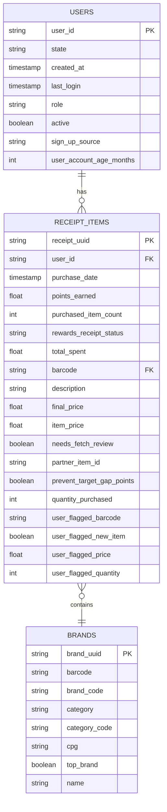

# scalable-data-modeling
This repository demonstrates an approach to structuring, modeling, and analyzing data. Using a modern data stack methodology, it features a scalable and efficient data model that transforms unstructured JSON data into a structured relational format, optimized for analytical queries.


# **dbt Analytics Project for  Rewards**
This repository contains dbt models, transformations, and tests for structuring and analyzing ** Rewards** data. The goal is to convert raw JSON data into structured tables optimized for analytics in **Snowflake**, leveraging **dbt** for transformation, validation, and documentation.

## **Project Overview**
This project extracts raw JSON files, normalizes them into **relational tables**, and transforms them into a structured data model using dbt. Key aspects of the project include:
- **Ingestion of JSON files** (users, receipts, brands) from `raw_json/`
- **Standardization of column names** to `snake_case`
- **Normalization of nested JSON fields** into structured tables
- **Data validation** through dbt tests (uniqueness, referential integrity, business rules)
- **Transformation of raw data** into a well-structured analytics schema in **Snowflake**
- **Automated dbt pipeline** to refresh transformed data

---

## **Data Processing Steps**
### **1. Raw Data Ingestion**
- The source data consists of **unstructured JSON files** located in `raw_json/`
- These JSON files are transformed into **CSV seeds** using a Python script
- The script performs the following:
  - Converts **nested JSON** into a tabular format
  - **Standardizes column names** to `snake_case`
  - **Truncates long fields** (> 131,072 characters) to avoid dbt errors
  - **Drops unnecessary columns** (`bonusPointsEarnedReason`)
  - **Stores cleaned CSV files** in `seeds/` for dbt ingestion

#### **Running the JSON Conversion Script**
To generate dbt seed files from raw JSON:
```bash
python scripts/json_to_csv.py
```
This script processes all files in `raw_json/` and outputs cleaned CSVs to `seeds/`.

---

### **2. Data Transformation Using dbt**
Once the CSV seeds are generated, dbt is used to **structure, clean, and validate the data**.

#### **dbt Models**
The project consists of **three key staging models**:
| Model | Description |
|-------|------------|
| `stg_seeds__users.sql` | Cleans and transforms raw user data |
| `stg_seeds__brands.sql` | Normalizes brand data |
| `stg_seeds__receipts.sql` | Processes receipts and flattens nested JSON fields |

#### **Executing dbt Transformations**
To run dbt transformations:
```bash
dbt run
```
To build models and ensure data integrity:
```bash
dbt build
```

---

### **3. Data Validation & Testing**
#### **Implemented dbt Tests**
| Test Type | Applied To | Purpose |
|-----------|-----------|---------|
| **Unique** | `user_id`, `brand_uuid`, `receipt_uuid` | Ensures no duplicate records exist |
| **Not Null** | Key fields (`state`, `purchase_date`, `total_spent`) | Ensures essential data is always present |
| **Relationships** | `user_id` in `stg_receipts` → `stg_users` | Ensures referential integrity |
| **Accepted Values** | `role` (should be `"CONSUMER"`) | Ensures `role` values are valid |
| **Expression Tests** | `total_spent >= 0`, `points_earned >= 0` | Ensures financial fields are never negative |

#### **Running dbt Tests**
To validate the data with dbt:
```bash
dbt test
```

---

### **4. dbt Sources & Schema Documentation**
#### **Source Configuration (`sources.yml`)**
Each raw table (`users`, `brands`, `receipts`) is defined as a **source** in dbt:
```yaml
version: 2

sources:
  - name: raw
    database: raw
    schema: raw
    tables:
      - name: users
      - name: brands
      - name: receipts
```
#### **Generating Documentation**
To generate **interactive dbt docs**:
```bash
dbt docs generate
dbt docs serve
```

---

## **Folder Structure**
```
fetch-dbt-project/
│── models/
│   ├── staging/
│   │   ├── stg_seeds__users.sql
│   │   ├── stg_seeds__brands.sql
│   │   ├── stg_seeds__receipts.sql
│   ├── schema.yml
│── seeds/
│   ├── users.csv
│   ├── brands.csv
│   ├── receipts.csv
│── scripts/
│   ├── json_to_csv.py
│── dbt_project.yml
│── README.md
```

---

## **How to Use This Project**
### **1️⃣ Set Up Your Environment**
Install dependencies:
```bash
pip install dbt-snowflake
```
Initialize dbt:
```bash
dbt init fetch-dbt-project
```

### **2️⃣ Process Raw JSON Data**
Run the Python script to convert JSON into dbt seed files:
```bash
python scripts/json_to_csv.py
```

### **3️⃣ Seed Data into Snowflake**
Load seed files into Snowflake:
```bash
dbt seed
```

### **4️⃣ Run dbt Models**
Execute transformations:
```bash
dbt run
```

### **5️⃣ Validate Data with dbt Tests**
```bash
dbt test
```

### **6️⃣ Generate Documentation**
```bash
dbt docs generate
dbt docs serve
```

---

## **Key Features**
✅ **Automated JSON Parsing** → Converts raw JSON into structured tables  
✅ **dbt Pipeline** → Automates transformations and data validation  
✅ **Robust Testing Suite** → Ensures data integrity and consistency  
✅ **Data Governance & Documentation** → Full schema documentation  

---


🔧 **Issues?**
If you encounter any issues, check the **error logs** in dbt or inspect the raw data in `seeds/`.

---
# **Entity-Relationship Diagrams (ERD)**



# **Analytics Queries for Rewards Data**

This document contains SQL queries to answer key business questions using the **Users**, **Receipt Items**, and **Brands** tables.

---

## **1️⃣ Top 5 Brands by Receipts Scanned for Most Recent Month**
### **Query**
```sql
with 

recent_month as (

    select 
        date_trunc('month', max(purchase_date)) as latest_month
        
    from fct_receipt_items r
    
    join dim_brands b 
        on r.barcode = b.barcode
    
)

select 
    b.name as brand_name,
    count(distinct r.receipt_uuid) as total_receipts
    
from fct_receipt_items r

join dim_brands b 
    on r.barcode = b.barcode

join recent_month rm 
    on date_trunc('month', r.purchase_date) = rm.latest_month

group by brand_name

order by total_receipts desc

limit 5;
```

### **Explanation**
- Retrieves the **most recent month** based on `purchase_date`.
- Counts the **number of receipts scanned per brand**.
- Returns **top 5 brands** based on receipt count.

### **Results Here**
```plaintext
BRAND_NAME	TOTAL_RECEIPTS
Cracker Barrel Cheese	10
Tostitos	10
Swanson	9
Prego	4
Diet Chris Cola	4
```

---

## **2️⃣ Month-over-Month Ranking of Top 5 Brands by Receipts Scanned**
### **Query**
```sql
with 

brand_rankings as (

    select 
        b.name as brand_name,
        date_trunc('month', r.purchase_date) as purchase_month,
        count(distinct r.receipt_uuid) as total_receipts,
        
        rank() over (
            partition by date_trunc('month', r.purchase_date) 
            order by count(distinct r.receipt_uuid) desc
        ) as brand_rank
        
    from fct_receipt_items r
    
    join dim_brands b 
        on r.barcode = b.barcode
    
    group by 1, 2
)

select * 

from brand_rankings

where brand_rank <= 5;
```

### **Explanation**
- Assigns **monthly rankings** for brands based on receipts scanned.
- Filters the results to include only **top 5 brands per month**.

### **Results Here**
```plaintext
BRAND_NAME	PURCHASE_MONTH	TOTAL_RECEIPTS	BRAND_RANK
Tostitos	2021-01-01 00:00:00.000	10	1
Cracker Barrel Cheese	2021-01-01 00:00:00.000	10	1
Swanson	2021-01-01 00:00:00.000	9	3
Diet Chris Cola	2021-01-01 00:00:00.000	4	4
Prego	2021-01-01 00:00:00.000	4	4
```

---

## **3️⃣ Average Spend on Accepted vs. Rejected Receipts**
### **Query**
```sql
select 
    rewards_receipt_status,
    round(avg(total_spent), 2) as avg_spend
    
from fct_receipt_items

where lower(rewards_receipt_status) in ('finished', 'rejected')

group by 1;
```

### **Explanation**
- Groups receipts by `rewards_receipt_status`.
- Computes **average spend** for `Accepted` vs. `Rejected` receipts. (`Accepted` doesn't exist in data so using `Finished`)

### **Paste Results Here**
```plaintext

```

---

## **4️⃣ Total Number of Items Purchased (Accepted vs. Rejected Receipts)**
### **Query**
```sql
select 
    rewards_receipt_status,
    round(avg(total_spent), 2) as avg_spend
    
from fct_receipt_items

where lower(rewards_receipt_status) in ('finished', 'rejected')

group by 1;
```

### **Explanation**
- Groups receipts by `rewards_receipt_status`.
- Computes **total number of items purchased** for `Accepted` vs. `Rejected` receipts.

### **Paste Results Here**
```plaintext
REWARDS_RECEIPT_STATUS	AVG_SPEND
FINISHED	1244.37
REJECTED	19.54
```

---

## **5️⃣ Brand with Most Spend Among Users Created in the Last 6 Months**
### **Query**
```sql
with 

recent_users as (

    select user_id 
    
    from dim_users
    
    where user_account_age_months <= 6
    
)

select 
    b.name as brand_name,
    sum(r.total_spent) as total_spent
    
from fct_receipt_items r

join dim_brands b
    on r.barcode = b.barcode
    
join recent_users u
    on r.user_id = u.user_id
    
group by 1

order by 2 desc

limit 1;
```

### **Explanation**
- Identifies **users who joined within the past 6 months**.
- Aggregates **total spend per brand** for these users.
- Returns the **brand with the highest total spend**.

### **Paste Results Here**
```plaintext
Data is from 2021 and no users are created in last 6 months
```

---

## **6️⃣ Brand with Most Transactions Among Users Created in the Last 6 Months**
### **Query**
```sql
with 

recent_users as (

    select user_id 

    from dim_users

    where user_account_age_months <= 6

)

select 
    b.name as brand_name,
    count(distinct r.receipt_uuid) as total_transactions

from receipt_items r

join dim_brands b 
    on r.barcode = b.barcode

join recent_users u 
    on r.user_id = u.user_id

group by 1

order by 2 desc

limit 1;
```

### **Explanation**
- Identifies **users who joined within the past 6 months**.
- Counts the **number of transactions per brand** for these users.
- Returns the **brand with the highest transaction count**.

### **Paste Results Here**
```plaintext
Data is from 2021 and no users are created in last 6 months
```

---


# **Testing the Data Pipeline**

This section provides details on how to test the data pipeline using dbt, including test execution, logs, and data quality issues found.

---

## **📌 How to Run Tests**
To validate data integrity and correctness, execute dbt tests with the following command:

```bash
dbt test
```

This runs all **data tests** on models, checking for **null values, unique constraints, referential integrity, and business logic**.

---

## **📌 Sample Test Run Logs**
Below are the raw logs from the last test run:

<details>
<summary>Click to expand logs</summary>

```
scalable-data-modeling-dOveYSm2 ❯ dbt test
21:50:02  Running with dbt=1.9.2
21:50:02  [WARNING]: Deprecated functionality

User config should be moved from the 'config' key in profiles.yml to the 'flags' key in dbt_project.yml.
21:50:02  Registered adapter: snowflake=1.9.1
21:50:03  [WARNING]: Configuration paths exist in your dbt_project.yml file which do not apply to any resources.
There are 1 unused configuration paths:
- models.reach.example
21:50:03  Found 7 models, 4 seeds, 63 data tests, 588 macros
21:50:03
21:50:03  Concurrency: 8 threads (target='dev')
21:50:03
21:50:03  1 of 63 START test accepted_values_stg_seeds__brands_top_brand__True__False ........................ [RUN]
21:50:03  3 of 63 START test accepted_values_stg_seeds__receipt_items_prevent_target_gap_points__True__False . [RUN]
21:50:03  4 of 63 START test accepted_values_stg_seeds__receipt_items_rewards_receipt_status__Accepted__Rejected__Pending__Finished  [RUN]
21:50:03  6 of 63 START test accepted_values_stg_seeds__receipts_rewards_receipt_status__Pending__Accepted__Rejected  [RUN]
21:50:03  5 of 63 START test accepted_values_stg_seeds__receipt_items_user_flagged_new_item__True__False ..... [RUN]
21:50:03  8 of 63 START test accepted_values_stg_seeds__users_role__CONSUMER ................................. [RUN]
21:50:03  7 of 63 START test accepted_values_stg_seeds__users_active__True__False ............................ [RUN]
21:50:03  2 of 63 START test accepted_values_stg_seeds__receipt_items_needs_fetch_review__True__False ........ [RUN]
21:50:03  1 of 63 PASS accepted_values_stg_seeds__brands_top_brand__True__False .............................. [PASS in 0.20s]
21:50:03  9 of 63 START test accepted_values_stg_seeds__users_state__AL__AK__AZ__AR__CA__CO__CT__DE__FL__GA__HI__ID__IL__IN__IA__KS__KY__LA__ME__MD__MA__MI__MN__MS__MO__MT__NE__NV__NH__NJ__NM__NY__NC__ND__OH__OK__OR__PA__RI__SC__SD__TN__TX__UT__VT__VA__WA__WV__WI__WY  [RUN]
21:50:04  9 of 63 PASS accepted_values_stg_seeds__users_state__AL__AK__AZ__AR__CA__CO__CT__DE__FL__GA__HI__ID__IL__IN__IA__KS__KY__LA__ME__MD__MA__MI__MN__MS__MO__MT__NE__NV__NH__NJ__NM__NY__NC__ND__OH__OK__OR__PA__RI__SC__SD__TN__TX__UT__VT__VA__WA__WV__WI__WY  [PASS in 0.15s]
21:50:04  10 of 63 START test dbt_utils_expression_is_true_stg_seeds__receipts_bonus_points_earned__bonus_points_earned_0  [RUN]
21:50:04  10 of 63 ERROR dbt_utils_expression_is_true_stg_seeds__receipts_bonus_points_earned__bonus_points_earned_0  [ERROR in 0.15s]
21:50:04  11 of 63 START test dbt_utils_expression_is_true_stg_seeds__receipts_points_earned__points_earned_0  [RUN]
21:50:04  8 of 63 FAIL 2 accepted_values_stg_seeds__users_role__CONSUMER ..................................... [FAIL 2 in 0.59s]
21:50:04  12 of 63 START test dbt_utils_expression_is_true_stg_seeds__receipts_purchased_item_count__purchased_item_count_0  [RUN]
21:50:04  4 of 63 FAIL 5 accepted_values_stg_seeds__receipt_items_rewards_receipt_status__Accepted__Rejected__Pending__Finished  [FAIL 5 in 0.62s]
21:50:04  13 of 63 START test dbt_utils_expression_is_true_stg_seeds__receipts_total_spent__total_spent_0 .... [RUN]
21:50:04  2 of 63 PASS accepted_values_stg_seeds__receipt_items_needs_fetch_review__True__False .............. [PASS in 0.63s]
21:50:04  6 of 63 FAIL 5 accepted_values_stg_seeds__receipts_rewards_receipt_status__Pending__Accepted__Rejected  [FAIL 5 in 0.63s]
21:50:04  14 of 63 START test expression_is_true_stg_seeds__receipt_items_final_price__final_price_0 ......... [RUN]
21:50:04  15 of 63 START test expression_is_true_stg_seeds__receipt_items_item_price__item_price_0 ........... [RUN]
21:50:04  7 of 63 PASS accepted_values_stg_seeds__users_active__True__False .................................. [PASS in 0.64s]
21:50:04  3 of 63 PASS accepted_values_stg_seeds__receipt_items_prevent_target_gap_points__True__False ....... [PASS in 0.65s]
21:50:04  5 of 63 PASS accepted_values_stg_seeds__receipt_items_user_flagged_new_item__True__False ........... [PASS in 0.65s]
21:50:04  16 of 63 START test expression_is_true_stg_seeds__receipt_items_points_earned__points_earned_0 ..... [RUN]
21:50:04  17 of 63 START test expression_is_true_stg_seeds__receipt_items_purchased_item_count__purchased_item_count_0  [RUN]
21:50:04  18 of 63 START test expression_is_true_stg_seeds__receipt_items_quantity_purchased__quantity_purchased_0  [RUN]
21:50:04  14 of 63 ERROR expression_is_true_stg_seeds__receipt_items_final_price__final_price_0 .............. [ERROR in 0.03s]
21:50:04  15 of 63 ERROR expression_is_true_stg_seeds__receipt_items_item_price__item_price_0 ................ [ERROR in 0.03s]
21:50:04  11 of 63 ERROR dbt_utils_expression_is_true_stg_seeds__receipts_points_earned__points_earned_0 ..... [ERROR in 0.15s]
21:50:04  16 of 63 ERROR expression_is_true_stg_seeds__receipt_items_points_earned__points_earned_0 .......... [ERROR in 0.02s]
21:50:04  17 of 63 ERROR expression_is_true_stg_seeds__receipt_items_purchased_item_count__purchased_item_count_0  [ERROR in 0.02s]
21:50:04  19 of 63 START test expression_is_true_stg_seeds__receipt_items_total_spent__total_spent_0 ......... [RUN]
21:50:04  20 of 63 START test expression_is_true_stg_seeds__receipt_items_user_flagged_price__user_flagged_price_0  [RUN]
21:50:04  21 of 63 START test expression_is_true_stg_seeds__receipt_items_user_flagged_quantity__user_flagged_quantity_0  [RUN]
21:50:04  18 of 63 ERROR expression_is_true_stg_seeds__receipt_items_quantity_purchased__quantity_purchased_0  [ERROR in 0.02s]
21:50:04  22 of 63 START test not_null_stg_seeds__brands_barcode ............................................. [RUN]
21:50:04  23 of 63 START test not_null_stg_seeds__brands_brand_code .......................................... [RUN]
21:50:04  24 of 63 START test not_null_stg_seeds__brands_brand_uuid .......................................... [RUN]
21:50:04  19 of 63 ERROR expression_is_true_stg_seeds__receipt_items_total_spent__total_spent_0 .............. [ERROR in 0.01s]
21:50:04  20 of 63 ERROR expression_is_true_stg_seeds__receipt_items_user_flagged_price__user_flagged_price_0  [ERROR in 0.01s]
21:50:04  21 of 63 ERROR expression_is_true_stg_seeds__receipt_items_user_flagged_quantity__user_flagged_quantity_0  [ERROR in 0.01s]
21:50:04  25 of 63 START test not_null_stg_seeds__brands_category ............................................ [RUN]
21:50:04  26 of 63 START test not_null_stg_seeds__brands_category_code ....................................... [RUN]
21:50:04  27 of 63 START test not_null_stg_seeds__brands_name ................................................ [RUN]
21:50:04  12 of 63 ERROR dbt_utils_expression_is_true_stg_seeds__receipts_purchased_item_count__purchased_item_count_0  [ERROR in 0.18s]
21:50:04  28 of 63 START test not_null_stg_seeds__brands_top_brand ........................................... [RUN]
21:50:04  13 of 63 ERROR dbt_utils_expression_is_true_stg_seeds__receipts_total_spent__total_spent_0 ......... [ERROR in 0.19s]
21:50:04  29 of 63 START test not_null_stg_seeds__receipt_items_barcode ...................................... [RUN]
21:50:04  24 of 63 PASS not_null_stg_seeds__brands_brand_uuid ................................................ [PASS in 0.16s]
21:50:04  30 of 63 START test not_null_stg_seeds__receipt_items_final_price .................................. [RUN]
21:50:04  27 of 63 PASS not_null_stg_seeds__brands_name ...................................................... [PASS in 0.15s]
21:50:04  22 of 63 PASS not_null_stg_seeds__brands_barcode ................................................... [PASS in 0.17s]
21:50:04  31 of 63 START test not_null_stg_seeds__receipt_items_item_price ................................... [RUN]
21:50:04  32 of 63 START test not_null_stg_seeds__receipt_items_points_earned ................................ [RUN]
21:50:04  23 of 63 FAIL 269 not_null_stg_seeds__brands_brand_code ............................................ [FAIL 269 in 0.19s]
21:50:04  25 of 63 FAIL 155 not_null_stg_seeds__brands_category .............................................. [FAIL 155 in 0.17s]
21:50:04  26 of 63 FAIL 650 not_null_stg_seeds__brands_category_code ......................................... [FAIL 650 in 0.18s]
21:50:04  33 of 63 START test not_null_stg_seeds__receipt_items_purchase_date ................................ [RUN]
21:50:04  34 of 63 START test not_null_stg_seeds__receipt_items_purchased_item_count ......................... [RUN]
21:50:04  35 of 63 START test not_null_stg_seeds__receipt_items_quantity_purchased ........................... [RUN]
21:50:04  28 of 63 FAIL 612 not_null_stg_seeds__brands_top_brand ............................................. [FAIL 612 in 0.12s]
21:50:04  36 of 63 START test not_null_stg_seeds__receipt_items_receipt_uuid ................................. [RUN]
21:50:04  29 of 63 FAIL 4291 not_null_stg_seeds__receipt_items_barcode ....................................... [FAIL 4291 in 0.13s]
21:50:04  37 of 63 START test not_null_stg_seeds__receipt_items_rewards_receipt_status ....................... [RUN]
21:50:04  31 of 63 FAIL 440 not_null_stg_seeds__receipt_items_item_price ..................................... [FAIL 440 in 0.15s]
21:50:04  38 of 63 START test not_null_stg_seeds__receipt_items_total_spent .................................. [RUN]
21:50:04  35 of 63 FAIL 440 not_null_stg_seeds__receipt_items_quantity_purchased ............................. [FAIL 440 in 0.13s]
21:50:04  39 of 63 START test not_null_stg_seeds__receipt_items_user_id ...................................... [RUN]
21:50:04  33 of 63 FAIL 458 not_null_stg_seeds__receipt_items_purchase_date .................................. [FAIL 458 in 0.14s]
21:50:04  34 of 63 PASS not_null_stg_seeds__receipt_items_purchased_item_count ............................... [PASS in 0.14s]
21:50:04  36 of 63 PASS not_null_stg_seeds__receipt_items_receipt_uuid ....................................... [PASS in 0.13s]
21:50:04  30 of 63 FAIL 440 not_null_stg_seeds__receipt_items_final_price .................................... [FAIL 440 in 0.17s]
21:50:04  40 of 63 START test not_null_stg_seeds__receipts_bonus_points_earned ............................... [RUN]
21:50:04  32 of 63 PASS not_null_stg_seeds__receipt_items_points_earned ...................................... [PASS in 0.17s]
21:50:04  41 of 63 START test not_null_stg_seeds__receipts_create_date ....................................... [RUN]
21:50:04  42 of 63 START test not_null_stg_seeds__receipts_date_scanned ...................................... [RUN]
21:50:04  43 of 63 START test not_null_stg_seeds__receipts_finished_date ..................................... [RUN]
21:50:04  44 of 63 START test not_null_stg_seeds__receipts_modify_date ....................................... [RUN]
21:50:04  37 of 63 PASS not_null_stg_seeds__receipt_items_rewards_receipt_status ............................. [PASS in 0.11s]
21:50:04  45 of 63 START test not_null_stg_seeds__receipts_points_awarded_date ............................... [RUN]
21:50:04  38 of 63 PASS not_null_stg_seeds__receipt_items_total_spent ........................................ [PASS in 0.16s]
21:50:04  46 of 63 START test not_null_stg_seeds__receipts_points_earned ..................................... [RUN]
21:50:04  39 of 63 PASS not_null_stg_seeds__receipt_items_user_id ............................................ [PASS in 0.15s]
21:50:04  47 of 63 START test not_null_stg_seeds__receipts_purchase_date ..................................... [RUN]
21:50:04  43 of 63 FAIL 551 not_null_stg_seeds__receipts_finished_date ....................................... [FAIL 551 in 0.16s]
21:50:04  48 of 63 START test not_null_stg_seeds__receipts_purchased_item_count .............................. [RUN]
21:50:04  40 of 63 FAIL 575 not_null_stg_seeds__receipts_bonus_points_earned ................................. [FAIL 575 in 0.17s]
21:50:04  41 of 63 PASS not_null_stg_seeds__receipts_create_date ............................................. [PASS in 0.17s]
21:50:04  45 of 63 FAIL 582 not_null_stg_seeds__receipts_points_awarded_date ................................. [FAIL 582 in 0.14s]
21:50:04  44 of 63 PASS not_null_stg_seeds__receipts_modify_date ............................................. [PASS in 0.17s]
21:50:04  42 of 63 PASS not_null_stg_seeds__receipts_date_scanned ............................................ [PASS in 0.18s]
21:50:04  49 of 63 START test not_null_stg_seeds__receipts_receipt_id ........................................ [RUN]
21:50:04  50 of 63 START test not_null_stg_seeds__receipts_rewards_receipt_item_list ......................... [RUN]
21:50:04  51 of 63 START test not_null_stg_seeds__receipts_rewards_receipt_status ............................ [RUN]
21:50:04  52 of 63 START test not_null_stg_seeds__receipts_total_spent ....................................... [RUN]
21:50:04  53 of 63 START test not_null_stg_seeds__receipts_user_id ........................................... [RUN]
21:50:05  46 of 63 FAIL 510 not_null_stg_seeds__receipts_points_earned ....................................... [FAIL 510 in 0.16s]
21:50:05  47 of 63 FAIL 448 not_null_stg_seeds__receipts_purchase_date ....................................... [FAIL 448 in 0.15s]
21:50:05  54 of 63 START test not_null_stg_seeds__users_active ............................................... [RUN]
21:50:05  55 of 63 START test not_null_stg_seeds__users_created_date ......................................... [RUN]
21:50:05  48 of 63 FAIL 484 not_null_stg_seeds__receipts_purchased_item_count ................................ [FAIL 484 in 0.15s]
21:50:05  56 of 63 START test not_null_stg_seeds__users_last_login ........................................... [RUN]
21:50:05  53 of 63 PASS not_null_stg_seeds__receipts_user_id ................................................. [PASS in 0.13s]
21:50:05  57 of 63 START test not_null_stg_seeds__users_role ................................................. [RUN]
21:50:05  51 of 63 PASS not_null_stg_seeds__receipts_rewards_receipt_status .................................. [PASS in 0.15s]
21:50:05  49 of 63 ERROR not_null_stg_seeds__receipts_receipt_id ............................................. [ERROR in 0.16s]
21:50:05  58 of 63 START test not_null_stg_seeds__users_state ................................................ [RUN]
21:50:05  59 of 63 START test not_null_stg_seeds__users_user_id .............................................. [RUN]
21:50:05  50 of 63 ERROR not_null_stg_seeds__receipts_rewards_receipt_item_list .............................. [ERROR in 0.17s]
21:50:05  60 of 63 START test unique_stg_seeds__brands_barcode ............................................... [RUN]
21:50:05  52 of 63 FAIL 435 not_null_stg_seeds__receipts_total_spent ......................................... [FAIL 435 in 0.17s]
21:50:05  61 of 63 START test unique_stg_seeds__brands_brand_uuid ............................................ [RUN]
21:50:05  55 of 63 PASS not_null_stg_seeds__users_created_date ............................................... [PASS in 0.12s]
21:50:05  62 of 63 START test unique_stg_seeds__receipts_receipt_id .......................................... [RUN]
21:50:05  60 of 63 FAIL 7 unique_stg_seeds__brands_barcode ................................................... [FAIL 7 in 0.11s]
21:50:05  63 of 63 START test unique_stg_seeds__users_user_id ................................................ [RUN]
21:50:05  57 of 63 PASS not_null_stg_seeds__users_role ....................................................... [PASS in 0.15s]
21:50:05  56 of 63 FAIL 62 not_null_stg_seeds__users_last_login .............................................. [FAIL 62 in 0.16s]
21:50:05  58 of 63 FAIL 56 not_null_stg_seeds__users_state ................................................... [FAIL 56 in 0.14s]
21:50:05  54 of 63 PASS not_null_stg_seeds__users_active ..................................................... [PASS in 0.18s]
21:50:05  61 of 63 PASS unique_stg_seeds__brands_brand_uuid .................................................. [PASS in 0.13s]
21:50:05  59 of 63 PASS not_null_stg_seeds__users_user_id .................................................... [PASS in 0.16s]
21:50:05  62 of 63 ERROR unique_stg_seeds__receipts_receipt_id ............................................... [ERROR in 0.12s]
21:50:05  63 of 63 FAIL 70 unique_stg_seeds__users_user_id ................................................... [FAIL 70 in 0.14s]
21:50:06
21:50:06  Finished running 63 data tests in 0 hours 0 minutes and 3.49 seconds (3.49s).
21:50:06
21:50:06  Completed with 38 errors, 0 partial successes, and 0 warnings:
21:50:06
21:50:06    Database Error in test dbt_utils_expression_is_true_stg_seeds__receipts_bonus_points_earned__bonus_points_earned_0 (models/staging/docs/stg_seeds__receipts.yml)
  001003 (42000): SQL compilation error:
  syntax error line 14 at position 30 unexpected 'bonus_points_earned'.
  compiled code at target/run/scalable_data_modeling/models/staging/docs/stg_seeds__receipts.yml/dbt_utils_expression_is_true_s_7acf45762bfb988b378dbd8ac2bda9da.sql
21:50:06
21:50:06  Failure in test accepted_values_stg_seeds__users_role__CONSUMER (models/staging/docs/stg_seeds__users.yml)
21:50:06    Got 2 results, configured to fail if != 0
21:50:06
21:50:06    compiled code at target/compiled/scalable_data_modeling/models/staging/docs/stg_seeds__users.yml/accepted_values_stg_seeds__users_role__CONSUMER.sql
21:50:06
21:50:06  Failure in test accepted_values_stg_seeds__receipt_items_rewards_receipt_status__Accepted__Rejected__Pending__Finished (models/staging/docs/stg_seeds__receipt_items.yml)
21:50:06    Got 5 results, configured to fail if != 0
21:50:06
21:50:06    compiled code at target/compiled/scalable_data_modeling/models/staging/docs/stg_seeds__receipt_items.yml/accepted_values_stg_seeds__rec_200e68e37d9f7760e7aebae2b963e06e.sql
21:50:06
21:50:06  Failure in test accepted_values_stg_seeds__receipts_rewards_receipt_status__Pending__Accepted__Rejected (models/staging/docs/stg_seeds__receipts.yml)
21:50:06    Got 5 results, configured to fail if != 0
21:50:06
21:50:06    compiled code at target/compiled/scalable_data_modeling/models/staging/docs/stg_seeds__receipts.yml/accepted_values_stg_seeds__rec_9835d9adf884cb964f943eb41ccb00b9.sql
21:50:06
21:50:06    Compilation Error in test expression_is_true_stg_seeds__receipt_items_final_price__final_price_0 (models/staging/docs/stg_seeds__receipt_items.yml)
  'test_expression_is_true' is undefined. This can happen when calling a macro that does not exist. Check for typos and/or install package dependencies with "dbt deps".
21:50:06
21:50:06    Compilation Error in test expression_is_true_stg_seeds__receipt_items_item_price__item_price_0 (models/staging/docs/stg_seeds__receipt_items.yml)
  'test_expression_is_true' is undefined. This can happen when calling a macro that does not exist. Check for typos and/or install package dependencies with "dbt deps".
21:50:06
21:50:06    Database Error in test dbt_utils_expression_is_true_stg_seeds__receipts_points_earned__points_earned_0 (models/staging/docs/stg_seeds__receipts.yml)
  001003 (42000): SQL compilation error:
  syntax error line 14 at position 24 unexpected 'points_earned'.
  compiled code at target/run/scalable_data_modeling/models/staging/docs/stg_seeds__receipts.yml/dbt_utils_expression_is_true_s_e3cf864c824303dc662c850e92f7c119.sql
21:50:06
21:50:06    Compilation Error in test expression_is_true_stg_seeds__receipt_items_points_earned__points_earned_0 (models/staging/docs/stg_seeds__receipt_items.yml)
  'test_expression_is_true' is undefined. This can happen when calling a macro that does not exist. Check for typos and/or install package dependencies with "dbt deps".
21:50:06
21:50:06    Compilation Error in test expression_is_true_stg_seeds__receipt_items_purchased_item_count__purchased_item_count_0 (models/staging/docs/stg_seeds__receipt_items.yml)
  'test_expression_is_true' is undefined. This can happen when calling a macro that does not exist. Check for typos and/or install package dependencies with "dbt deps".
21:50:06
21:50:06    Compilation Error in test expression_is_true_stg_seeds__receipt_items_quantity_purchased__quantity_purchased_0 (models/staging/docs/stg_seeds__receipt_items.yml)
  'test_expression_is_true' is undefined. This can happen when calling a macro that does not exist. Check for typos and/or install package dependencies with "dbt deps".
21:50:06
21:50:06    Compilation Error in test expression_is_true_stg_seeds__receipt_items_total_spent__total_spent_0 (models/staging/docs/stg_seeds__receipt_items.yml)
  'test_expression_is_true' is undefined. This can happen when calling a macro that does not exist. Check for typos and/or install package dependencies with "dbt deps".
21:50:06
21:50:06    Compilation Error in test expression_is_true_stg_seeds__receipt_items_user_flagged_price__user_flagged_price_0 (models/staging/docs/stg_seeds__receipt_items.yml)
  'test_expression_is_true' is undefined. This can happen when calling a macro that does not exist. Check for typos and/or install package dependencies with "dbt deps".
21:50:06
21:50:06    Compilation Error in test expression_is_true_stg_seeds__receipt_items_user_flagged_quantity__user_flagged_quantity_0 (models/staging/docs/stg_seeds__receipt_items.yml)
  'test_expression_is_true' is undefined. This can happen when calling a macro that does not exist. Check for typos and/or install package dependencies with "dbt deps".
21:50:06
21:50:06    Database Error in test dbt_utils_expression_is_true_stg_seeds__receipts_purchased_item_count__purchased_item_count_0 (models/staging/docs/stg_seeds__receipts.yml)
  001003 (42000): SQL compilation error:
  syntax error line 14 at position 31 unexpected 'purchased_item_count'.
  compiled code at target/run/scalable_data_modeling/models/staging/docs/stg_seeds__receipts.yml/dbt_utils_expression_is_true_s_bda90eca9143206096ac6632dd1849ff.sql
21:50:06
21:50:06    Database Error in test dbt_utils_expression_is_true_stg_seeds__receipts_total_spent__total_spent_0 (models/staging/docs/stg_seeds__receipts.yml)
  001003 (42000): SQL compilation error:
  syntax error line 14 at position 22 unexpected 'total_spent'.
  compiled code at target/run/scalable_data_modeling/models/staging/docs/stg_seeds__receipts.yml/dbt_utils_expression_is_true_s_50527647461f697b3687f78214e42a64.sql
21:50:06
21:50:06  Failure in test not_null_stg_seeds__brands_brand_code (models/staging/docs/stg_seeds__brands.yml)
21:50:06    Got 269 results, configured to fail if != 0
21:50:06
21:50:06    compiled code at target/compiled/scalable_data_modeling/models/staging/docs/stg_seeds__brands.yml/not_null_stg_seeds__brands_brand_code.sql
21:50:06
21:50:06  Failure in test not_null_stg_seeds__brands_category (models/staging/docs/stg_seeds__brands.yml)
21:50:06    Got 155 results, configured to fail if != 0
21:50:06
21:50:06    compiled code at target/compiled/scalable_data_modeling/models/staging/docs/stg_seeds__brands.yml/not_null_stg_seeds__brands_category.sql
21:50:06
21:50:06  Failure in test not_null_stg_seeds__brands_category_code (models/staging/docs/stg_seeds__brands.yml)
21:50:06    Got 650 results, configured to fail if != 0
21:50:06
21:50:06    compiled code at target/compiled/scalable_data_modeling/models/staging/docs/stg_seeds__brands.yml/not_null_stg_seeds__brands_category_code.sql
21:50:06
21:50:06  Failure in test not_null_stg_seeds__brands_top_brand (models/staging/docs/stg_seeds__brands.yml)
21:50:06    Got 612 results, configured to fail if != 0
21:50:06
21:50:06    compiled code at target/compiled/scalable_data_modeling/models/staging/docs/stg_seeds__brands.yml/not_null_stg_seeds__brands_top_brand.sql
21:50:06
21:50:06  Failure in test not_null_stg_seeds__receipt_items_barcode (models/staging/docs/stg_seeds__receipt_items.yml)
21:50:06    Got 4291 results, configured to fail if != 0
21:50:06
21:50:06    compiled code at target/compiled/scalable_data_modeling/models/staging/docs/stg_seeds__receipt_items.yml/not_null_stg_seeds__receipt_items_barcode.sql
21:50:06
21:50:06  Failure in test not_null_stg_seeds__receipt_items_item_price (models/staging/docs/stg_seeds__receipt_items.yml)
21:50:06    Got 440 results, configured to fail if != 0
21:50:06
21:50:06    compiled code at target/compiled/scalable_data_modeling/models/staging/docs/stg_seeds__receipt_items.yml/not_null_stg_seeds__receipt_items_item_price.sql
21:50:06
21:50:06  Failure in test not_null_stg_seeds__receipt_items_quantity_purchased (models/staging/docs/stg_seeds__receipt_items.yml)
21:50:06    Got 440 results, configured to fail if != 0
21:50:06
21:50:06    compiled code at target/compiled/scalable_data_modeling/models/staging/docs/stg_seeds__receipt_items.yml/not_null_stg_seeds__receipt_items_quantity_purchased.sql
21:50:06
21:50:06  Failure in test not_null_stg_seeds__receipt_items_purchase_date (models/staging/docs/stg_seeds__receipt_items.yml)
21:50:06    Got 458 results, configured to fail if != 0
21:50:06
21:50:06    compiled code at target/compiled/scalable_data_modeling/models/staging/docs/stg_seeds__receipt_items.yml/not_null_stg_seeds__receipt_items_purchase_date.sql
21:50:06
21:50:06  Failure in test not_null_stg_seeds__receipt_items_final_price (models/staging/docs/stg_seeds__receipt_items.yml)
21:50:06    Got 440 results, configured to fail if != 0
21:50:06
21:50:06    compiled code at target/compiled/scalable_data_modeling/models/staging/docs/stg_seeds__receipt_items.yml/not_null_stg_seeds__receipt_items_final_price.sql
21:50:06
21:50:06  Failure in test not_null_stg_seeds__receipts_finished_date (models/staging/docs/stg_seeds__receipts.yml)
21:50:06    Got 551 results, configured to fail if != 0
21:50:06
21:50:06    compiled code at target/compiled/scalable_data_modeling/models/staging/docs/stg_seeds__receipts.yml/not_null_stg_seeds__receipts_finished_date.sql
21:50:06
21:50:06  Failure in test not_null_stg_seeds__receipts_bonus_points_earned (models/staging/docs/stg_seeds__receipts.yml)
21:50:06    Got 575 results, configured to fail if != 0
21:50:06
21:50:06    compiled code at target/compiled/scalable_data_modeling/models/staging/docs/stg_seeds__receipts.yml/not_null_stg_seeds__receipts_bonus_points_earned.sql
21:50:06
21:50:06  Failure in test not_null_stg_seeds__receipts_points_awarded_date (models/staging/docs/stg_seeds__receipts.yml)
21:50:06    Got 582 results, configured to fail if != 0
21:50:06
21:50:06    compiled code at target/compiled/scalable_data_modeling/models/staging/docs/stg_seeds__receipts.yml/not_null_stg_seeds__receipts_points_awarded_date.sql
21:50:06
21:50:06  Failure in test not_null_stg_seeds__receipts_points_earned (models/staging/docs/stg_seeds__receipts.yml)
21:50:06    Got 510 results, configured to fail if != 0
21:50:06
21:50:06    compiled code at target/compiled/scalable_data_modeling/models/staging/docs/stg_seeds__receipts.yml/not_null_stg_seeds__receipts_points_earned.sql
21:50:06
21:50:06  Failure in test not_null_stg_seeds__receipts_purchase_date (models/staging/docs/stg_seeds__receipts.yml)
21:50:06    Got 448 results, configured to fail if != 0
21:50:06
21:50:06    compiled code at target/compiled/scalable_data_modeling/models/staging/docs/stg_seeds__receipts.yml/not_null_stg_seeds__receipts_purchase_date.sql
21:50:06
21:50:06  Failure in test not_null_stg_seeds__receipts_purchased_item_count (models/staging/docs/stg_seeds__receipts.yml)
21:50:06    Got 484 results, configured to fail if != 0
21:50:06
21:50:06    compiled code at target/compiled/scalable_data_modeling/models/staging/docs/stg_seeds__receipts.yml/not_null_stg_seeds__receipts_purchased_item_count.sql
21:50:06
21:50:06    Database Error in test not_null_stg_seeds__receipts_receipt_id (models/staging/docs/stg_seeds__receipts.yml)
  000904 (42000): SQL compilation error: error line 12 at position 7
  invalid identifier 'RECEIPT_ID'
  compiled code at target/run/scalable_data_modeling/models/staging/docs/stg_seeds__receipts.yml/not_null_stg_seeds__receipts_receipt_id.sql
21:50:06
21:50:06    Database Error in test not_null_stg_seeds__receipts_rewards_receipt_item_list (models/staging/docs/stg_seeds__receipts.yml)
  000904 (42000): SQL compilation error: error line 12 at position 7
  invalid identifier 'REWARDS_RECEIPT_ITEM_LIST'
  compiled code at target/run/scalable_data_modeling/models/staging/docs/stg_seeds__receipts.yml/not_null_stg_seeds__receipts_rewards_receipt_item_list.sql
21:50:06
21:50:06  Failure in test not_null_stg_seeds__receipts_total_spent (models/staging/docs/stg_seeds__receipts.yml)
21:50:06    Got 435 results, configured to fail if != 0
21:50:06
21:50:06    compiled code at target/compiled/scalable_data_modeling/models/staging/docs/stg_seeds__receipts.yml/not_null_stg_seeds__receipts_total_spent.sql
21:50:06
21:50:06  Failure in test unique_stg_seeds__brands_barcode (models/staging/docs/stg_seeds__brands.yml)
21:50:06    Got 7 results, configured to fail if != 0
21:50:06
21:50:06    compiled code at target/compiled/scalable_data_modeling/models/staging/docs/stg_seeds__brands.yml/unique_stg_seeds__brands_barcode.sql
21:50:06
21:50:06  Failure in test not_null_stg_seeds__users_last_login (models/staging/docs/stg_seeds__users.yml)
21:50:06    Got 62 results, configured to fail if != 0
21:50:06
21:50:06    compiled code at target/compiled/scalable_data_modeling/models/staging/docs/stg_seeds__users.yml/not_null_stg_seeds__users_last_login.sql
21:50:06
21:50:06  Failure in test not_null_stg_seeds__users_state (models/staging/docs/stg_seeds__users.yml)
21:50:06    Got 56 results, configured to fail if != 0
21:50:06
21:50:06    compiled code at target/compiled/scalable_data_modeling/models/staging/docs/stg_seeds__users.yml/not_null_stg_seeds__users_state.sql
21:50:06
21:50:06    Database Error in test unique_stg_seeds__receipts_receipt_id (models/staging/docs/stg_seeds__receipts.yml)
  000904 (42000): SQL compilation error: error line 11 at position 4
  invalid identifier 'RECEIPT_ID'
  compiled code at target/run/scalable_data_modeling/models/staging/docs/stg_seeds__receipts.yml/unique_stg_seeds__receipts_receipt_id.sql
21:50:06
21:50:06  Failure in test unique_stg_seeds__users_user_id (models/staging/docs/stg_seeds__users.yml)
21:50:06    Got 70 results, configured to fail if != 0
21:50:06
21:50:06    compiled code at target/compiled/scalable_data_modeling/models/staging/docs/stg_seeds__users.yml/unique_stg_seeds__users_user_id.sql
21:50:06
21:50:06  Done. PASS=25 WARN=0 ERROR=38 SKIP=0 TOTAL=63
```
</details>

---

## **📌 Summary of Data Quality Issues**
The following **data quality issues** were identified in the latest test run:

| **Test Name** | **Issue** | **Failed Rows** |
|--------------|----------|---------------|
| `accepted_values_stg_seeds__users_role__CONSUMER` | Unexpected user roles found | 2 |
| `accepted_values_stg_seeds__receipt_items_rewards_receipt_status` | Invalid receipt statuses detected | 5 |
| `not_null_stg_seeds__brands_brand_code` | Missing brand codes | 269 |
| `not_null_stg_seeds__receipts_total_spent` | Null values in total spent field | 435 |
| `unique_stg_seeds__users_user_id` | Duplicate user IDs detected | 70 |

---

🚀 **By continuously monitoring these issues, we improve data reliability and analytics accuracy.**


# Slack Communication

Hey Team,

We've been working on refining our data pipeline to ensure we have a clean, reliable, and scalable dataset for analytics. As we tested our recent ingestion, we surfaced several key data quality issues that need attention before we can confidently use this data for decision-making.

🔍 Key Findings & Questions

1️⃣ Data Completeness Issues: We found missing values in critical fields like brand_code, total_spent, and purchase_date. Do we have rules around how missing values should be handled, or should we exclude incomplete records?

2️⃣ Unexpected Values & Inconsistencies: Some rewards_receipt_status values don’t match expected categories (Accepted, Rejected, etc.). Are there edge cases in our system that might introduce additional statuses?

3️⃣ Duplicate & Integrity Checks: We identified duplicate user_ids and non-unique barcodes in the brands dataset. Should we enforce stricter constraints on these fields, or do legitimate cases exist where duplication is expected?

🛠️ How We Discovered These Issues
We implemented automated data validation tests in dbt, checking for: 

✅ Missing values in required fields

✅ Unexpected categorical values

✅ Duplicates where uniqueness should be enforced

Our last test run showed 38 failures across different models, which we've documented.

📊 What We Need to Resolve This

Business rules on handling missing & duplicate data: Should we drop, impute, or infer values?
Clarification on system behavior: Are there any scenarios where unexpected values in rewards_receipt_status would be valid?

Volume & Data Growth Expectations: Understanding expected data size will help us optimize indexing, partitioning, and query performance.

🚀 Scaling & Performance Considerations

As data volume grows, we anticipate potential bottlenecks in query performance and storage costs. To mitigate this, we're considering:

✔️ Indexing & partitioning strategies to optimize query speed

✔️ Incremental data loads to prevent full table scans

✔️ Monitoring & alerting on data quality regressions

We’d love to sync on these items to ensure data consistency and alignment with business needs before pushing this into production. Let me know when we can discuss!

Thanks,

Devin
